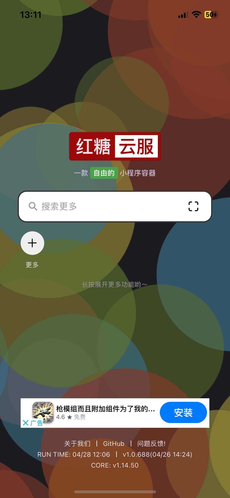
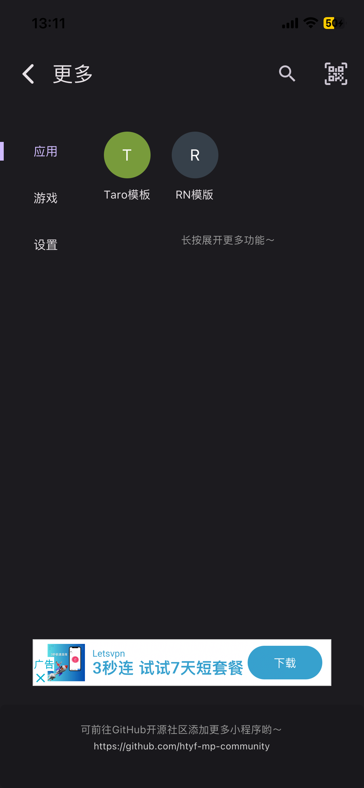
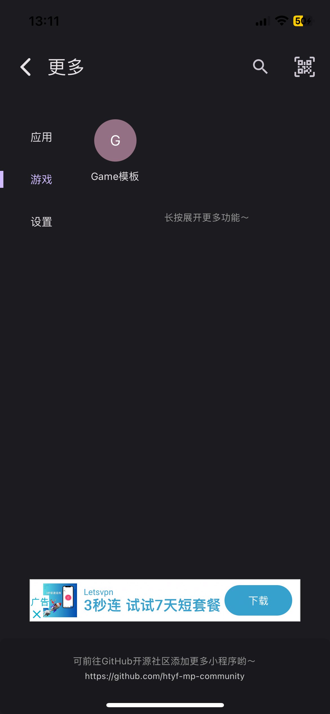
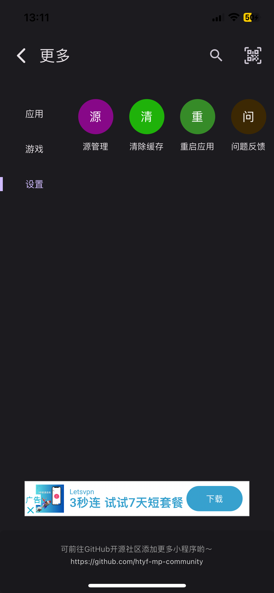
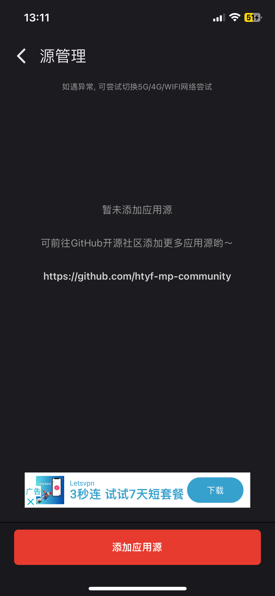
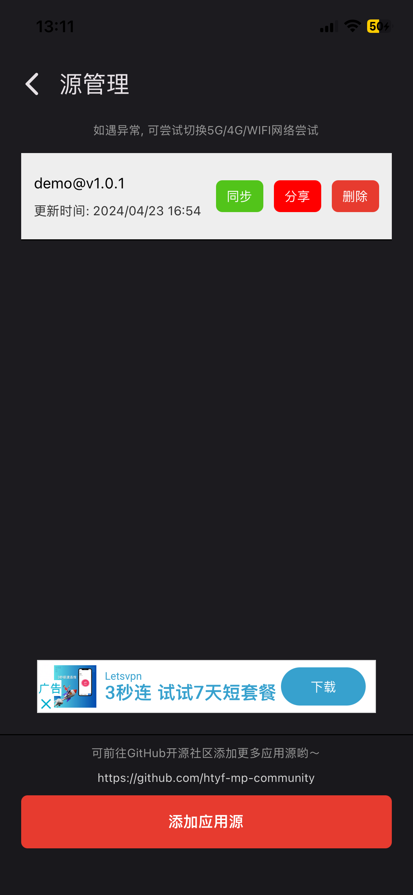

# 红糖云服app 小程序模板 CLI

用于构建红糖云服小程序的前端框架模板

## 使用

生成一个新项目:

```sh
npx @htyf-mp/cli
```

接下来，使用CLI配置项目名和Appid，或者稍后再配置，最后选择模板类型

### 运行应用程序

进入`mini-apps-template`或`mini-game-template`目录并运行:
> 具体模板使用，可参考模板内的README.md
```sh
npm start
```

## 预览

| 首页  | 小程序 | 小游戏 | 设置 | 添加源 | 管理源 |
| ------------- | ------------- | ------------- | ------------- | ------------- | ------------- |
|   |  |   |   |   |   |

## 投食

开发迭代不易，觉得 App 好用的，有能力的请投喂一下，也可以给个星星

| 微信  | 支付宝 |
| ------------- | ------------- |
|   |  |